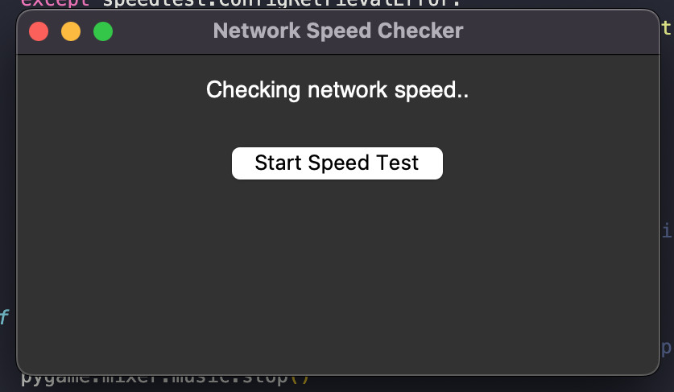
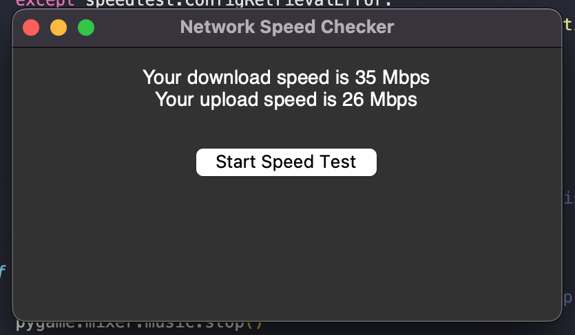

# Network Speed Checker

This program is a simple GUI application written in Python using the Tkinter library. It is designed to check and display the network speed of the user's internet connection. The application features a graphical user interface (GUI) with a label to display the network speed information and a button to initiate the speed test.

Here's a breakdown of the key components and features of the program:

### Tkinter GUI:

The GUI is created using the Tkinter library, providing a basic window with a label and a button.
The label (self.label_result) is initially empty and will be used to display messages and network speed information.
## Network Speed Test Logic:

The application uses the speedtest library to perform a network speed test.
When the user clicks the "Start Speed Test" button, the program initiates a threaded process (self.perform_speed_test) to simulate a network speed test, displaying progress dots in the label.

### Sound Effects:
The program incorporates background sound and a start test sound effect using the pygame library.
The background sound (background_sound.wav) plays continuously in a separate thread when the application starts, creating a pleasant auditory ambiance.
The start test sound plays when the user clicks the "Start Speed Test" button. This sound is designed to be brief and provides a sound cue for the initiation of the speed test.

### Threading:
Threading is implemented to ensure that the GUI remains responsive during the network speed test and sound playback.
The threading module is used to run the speed test and play sounds concurrently without freezing the GUI.

### Volume Control:

The application allows for volume control of both the background sound and the start test sound.
The pygame.mixer module is used to set and control the volume levels for the sounds.

### Error Handling:

The program includes basic error handling to catch exceptions that may occur during the network speed test process, such as a configuration retrieval error or other unexpected issues.
Error messages are displayed in the label to inform the user about any problems that may arise.

### Graceful Exit:
The program handles window closing events (self.on_closing) to stop the background sound and close the application gracefully when the user decides to exit.
Overall, the application provides a user-friendly interface for checking network speed, enhancing the user experience with visual and auditory feedback during the speed test process.

------------------------------------------------------------------------------

